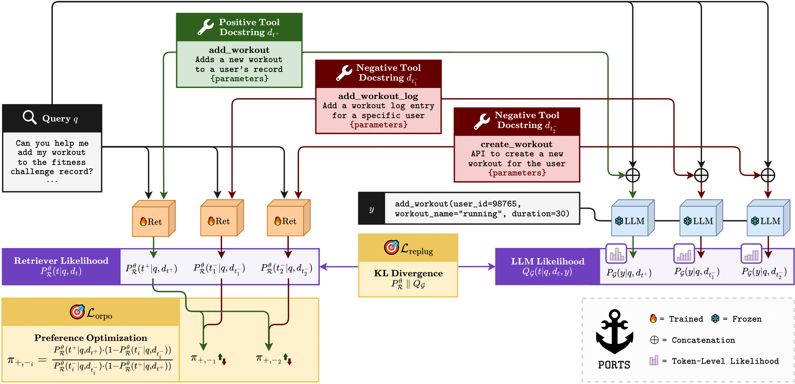

<div align="center"> </div>
<h1 align="center"> PORTS</h1>
<h2 align="center">Preference-Optimized Retrievers for Tool Selection with Large Language Models  </h2>

This repository contains the code and datasets for reproducing the experiments described in the paper titled "**PORTS: Preference-Optimized Retrievers for Tool Selection with Large Language Models.**" The paper introduces **PORTS**, a novel method to fine-tune retrievers that align with the preferences of a frozen Large Language Model for tool selection tasks. By optimizing the correlation between retrieval probabilities and downstream performance, **PORTS** enhances the accuracy of tool selection while maintaining low computational demands. The approach is validated through extensive experiments on six diverse datasets, demonstrating significant improvements in tool selection accuracy compared to existing methods.


## TODO

- [x] Merge modalities into unified src interface
- [ ] Remove `src_{port,replug,mnlr}`


<br/>
<p align="center">

</p>


## 📎 Table of Contents

- [Model](#model)
- [Dataset](#dataset)
- [Project Structure](#project-structure)
- [Quickstart](#quickstart)
- [Using the Markdown File](#using-the-markdown-file)
- [Script-based Training](#script-based-training)
- [Sbatch-based Grid Search Training](#sbatch-based-grid-search-training)
- [Main Accuracy Results](#main-accuracy-results)
- [Unsloth Integration](#unsloth-integration)

## Model

**PORTS** fine-tunes a retriever model to select the most appropriate tools based on preferences derived from a frozen LLM. The retriever is optimized through a dual loss approach: a perplexity-based preference signal and a contrastive semantic loss. This ensures the retriever aligns with the LLM's preferences, leading to more accurate tool selection in various scenarios. The model is trained on two encoder architectures, RoBERTa-base and BGE-base, and evaluated using three LLMs with varying levels of expertise in tool usage.

## Dataset

The experiments are conducted on six publicly available datasets, which include APIBench, API-Bank, Octopus-v2, ToolE, BFCL, and ToolBench. These datasets cover various applications, input modalities, and toolsets, comprehensively evaluating **PORTS**' effectiveness. Datasets can be found [here](https://anonymous.4open.science/r/ports-data/).

## Project Structure

The repository is organized with the following structure:

```
/ports/
├── Makefile              # Entry point for all training commands
├── main/                 # Main code directory
│   ├── scripts/          # All training and utility scripts
│   ├── src/              # Source code modules
│   │   ├── port/         # PORTS model implementation
│   │   ├── replug/       # RePlug model implementation  
│   │   ├── dml/          # DML (MNRL) implementation
│   │   └── utils/        # Shared utilities
│   ├── main_train_port.py # Main PORTS training script
│   ├── train_replug.py   # RePlug training script
│   ├── train_mnrl.py     # MNRL training script
│   └── output/           # Output directory for trained models
├── datasets/             # Training and evaluation datasets
└── assets/               # Project assets and documentation
```

## Quickstart

### Setup

1. **Clone the repository:**
   ```bash
   git clone https://github.com/yourorg/ports.git
   cd ports
   ```

2. **Install the required dependencies:**
   ```bash
   pip install -r build/requirements.txt
   ```

3. **Download the datasets:**
   The datasets can be downloaded from the following link: [PORTS Datasets](https://anonymous.4open.science/r/ports-data/). Extract the datasets into the `datasets/` directory.

### Using the Makefile

We provide a Makefile that offers a clean interface for running all training operations. This is the recommended way to launch training and evaluation jobs, as it ensures consistent defaults and easy overrides.

### Running Training via Makefile

#### 1. PORTS Training

```bash
make ports
```

#### 2. RePlug Training

```bash
make replug
```

#### 3. MNRL Training

```bash
make mnrl
```

#### 4. Docker (interactive)

```bash
make docker
```

#### 5. Clean Output Directories

```bash
make clean
```

### Overriding Defaults

You can override any default parameter by specifying it on the command line. For example:

```bash
make ports DATASET=bfcl INFERENCE_MODEL=gemma2-2B
make replug EPOCHS=10 BATCH_SIZE=4
make mnrl RETRIEVAL_MODEL=FacebookAI/roberta-base
```

### Available Parameters

#### Common Parameters (all training methods)

| Parameter | Description | Default |
|-----------|-------------|---------|
| `DATASET` | Dataset name | toolbench |
| `RETRIEVAL_MODEL` | Retrieval model name | BAAI/bge-base-en-v1.5 |
| `INFERENCE_MODEL` | Inference model name | llama3-8B |
| `EPOCHS` | Number of training epochs | 5 |
| `BATCH_SIZE` | Training batch size | 2 |
| `LR` | Learning rate | 1e-5 |
| `SEED` | Random seed | 42 |
| `EVAL_STEPS` | Evaluation steps fraction | 0.2 |
| `USE_4BIT` | Use 4-bit quantization | true |
| `MAX_TRAIN_SAMPLES` | Maximum training samples | 1000 |
| `GAMMA` | Gamma temperature | 0.5 |
| `BETA` | Beta temperature | 0.5 |
| `WARMUP_RATIO` | Fraction of training steps for warmup | 0.1 |
| `K_EVAL_VALUES_ACCURACY` | Values of k for accuracy@k evaluation | 1 3 5 |
| `K_EVAL_VALUES_NDCG` | Values of k for ndcg@k evaluation | 1 3 5 |

#### MNRL-Specific Parameters

| Parameter | Description | Default |
|-----------|-------------|---------|
| `SCHEDULER` | Learning rate scheduler | warmupcosine |
| `POOLING` | Embedding pooling strategy | mean |
| `NEGATIVES_PER_SAMPLE` | Number of negative samples | 1 |
| `MODEL_NAME` | Retrieval model name | BAAI/bge-base-en-v1.5 |
| `PREPROCESSING_BATCH_SIZE` | Batch size for preprocessing | 16 |
| `EVAL_STEPS_FRACTION` | Fraction of steps for evaluation | 0.2 |
| `WANDB_PROJECT_NAME` | Weights & Biases project name | MNRL_Training |
| `WANDB_RUN_NAME` | Weights & Biases run name | auto-generated |
| `OUTPUT_DIR` | Directory to save model, logs, and results | auto-generated |
| `RANDOM_NEGATIVES` | Whether to use random negatives | true |
| `EVALUATE_ON_TEST` | Whether to evaluate on test set | true |
| `USE_PRE_TRAINED_MODEL` | Whether to use pre-trained model | true |
| `PUSH_TO_HUB` | Whether to push model to HF Hub | true |
| `PUBLIC_MODEL` | Whether to make model public | true |
| `HUB_REPO_NAME` | HuggingFace Hub repo name | auto-generated |
| `LOG_FILE` | Path to log file | auto-generated |
| `WARMUP_RATIO` | Fraction of training steps for warmup | 0.1 |

### Example Usage

```bash
# Train PORTS with non-default parameters
make ports DATASET=apibench INFERENCE_MODEL=llama3-8B EPOCHS=3 LAMBDA_WEIGHT=0.5 PREF_BETA=0.8

# Train RePlug with customized retrieval settings
make replug DATASET=bfcl RETRIEVAL_MODEL=FacebookAI/roberta-base NUM_RETRIEVED_DOCS=8 GAMMA=0.3

# Train MNRL with specific pooling strategy and batch size
make mnrl DATASET=octopus RETRIEVAL_MODEL=BAAI/bge-base-en-v1.5 POOLING=cls BATCH_SIZE=64
```

### Notes

- The Makefile will call the appropriate script in `main/scripts/` with all parameters set.
- Output directories are automatically created.
- For advanced usage or script-specific parameters, see the script-based training section below.

## Using the Markdown File

In addition to the code and datasets, this repository includes a comprehensive Markdown documentation that can help you understand and use the PORTS framework effectively. Here's how to use it:

### Reading the Markdown Documentation

1. **Viewing in GitHub**: 
   The README.md file is automatically rendered by GitHub's web interface. Simply navigate to the repository's main page to view it with proper formatting and styling.

2. **Local Viewing Options**:
   - Use any text editor to open the README.md file
   - For better rendering, use a Markdown viewer like:
     - VS Code with the Markdown Preview extension
     - Typora, a dedicated Markdown editor
     - GitHub Desktop's built-in Markdown preview

### Documentation Structure

The Markdown documentation is organized into clear sections:

- **Model Description**: Technical details about PORTS architecture
- **Dataset Information**: Details about supported datasets and their structure
- **Project Structure**: Overview of code organization
- **Quickstart Guide**: Step-by-step instructions for getting started
- **Training Options**: Comprehensive list of parameters and configurations
- **Results**: Performance metrics and comparisons

### Modifying the Documentation

If you need to update the documentation:

1. Edit the README.md file using any text editor
2. Follow standard Markdown syntax:
   - `#` for headers (more `#` means smaller headers)
   - `*` or `-` for bullet points
   - `|` for table columns
   - `` ``` `` for code blocks (specify language after opening backticks)
   - `[text](url)` for links
   - `` for images

3. Use HTML tags for advanced formatting:
   - `<div align="center">` for centering content
   - `` for image sizing
   - `<br/>` for line breaks

4. Preview changes using a Markdown viewer before committing

### Extending the Documentation

When adding new features or models to the project, be sure to update:

1. The Table of Contents section
2. The relevant documentation section
3. Any code examples or parameter lists
4. Training and evaluation result tables

Remember to maintain consistent formatting and style to ensure readability.

## Script-based Training

You can also run training using the provided shell scripts, which are aligned with the Makefile and support environment variable overrides for all key parameters.

### 1. PORTS Training

Run the PORTS training script:

```bash
bash main/scripts/train_ports.sh
```

#### Overriding Defaults

You can override any default by setting the corresponding environment variable before the script call:

```bash
DATASET_NAME=bfcl INFERENCE_MODEL_PSEUDONAME=gemma2-2B RETRIEVAL_MODEL_NAME=FacebookAI/roberta-base bash main/scripts/train_ports.sh
```

#### All Environment Variables (PORTS)

| Variable | Description | Default |
|----------|-------------|---------|
| `DATASET_NAME` | Dataset name | toolbench |
| `RETRIEVAL_MODEL_NAME` | Retrieval model name | BAAI/bge-base-en-v1.5 |
| `INFERENCE_MODEL_PSEUDONAME` | Inference model pseudo-name | llama3-8B |
| `RETRIEVAL_MAX_SEQ_LEN` | Max seq length for retriever | 512 |
| `INFERENCE_MAX_SEQ_LEN` | Max seq length for inference | 1024 |
| `N_EPOCHS` | Number of epochs | 5 |
| `LR` | Learning rate | 1e-5 |
| `LR_SCHEDULER` | Learning rate scheduler | cosine |
| `TRAIN_BATCH_SIZE` | Training batch size | 2 |
| `EVAL_BATCH_SIZE` | Evaluation batch size | 4 |
| `PREPROCESS_BATCH_SIZE` | Preprocessing batch size | 16 |
| `PADDING_SIDE` | Tokenizer padding side | left |
| `LAMBDA_WEIGHT` | Lambda loss weight | 0.3 |
| `N_NEGS` | Number of negative examples | 3 |
| `GAMMA` | Gamma temperature | 0.5 |
| `BETA` | Beta temperature | 0.5 |
| `PREF_BETA` | Preference weight (ORPO beta) | 1 |
| `WEIGHT_DECAY` | Weight decay for optimizer | 0.01 |
| `CORPUS_UPDATES` | Steps between corpus re-embedding | 100 |
| `SAVE_STRATEGY` | Model saving strategy | epoch |
| `SAVE_STEPS` | Steps between model saves | None |
| `SAVE_DIR` | Directory to save checkpoints | ./checkpoints |
| `MAX_CHECKPOINTS` | Maximum number of checkpoints | None |
| `SEED` | Random seed | 42 |
| `EVAL_STEPS` | Evaluation steps fraction | 0.2 |
| `LOAD_IN_4BIT` | Use 4-bit quantization | true |
| `MAX_TRAIN_SAMPLES` | Maximum training samples | 1000 |
| `WARMUP_RATIO` | Fraction of training steps for warmup | 0.1 |
| `WANDB_RUN_NAME` | Weights & Biases run name | auto-generated |
| `K_EVAL_VALUES_ACCURACY` | Values for accuracy@k | 1 3 5 |
| `K_EVAL_VALUES_NDCG` | Values for ndcg@k | 1 3 5 |

### 2. RePlug Training

Run the RePlug training script:

```bash
bash main/scripts/train_replug.sh
```

#### Overriding Defaults

```bash
DATASET_NAME=bfcl INFERENCE_MODEL_PSEUDONAME=gemma2-2B RETRIEVAL_MODEL_NAME=FacebookAI/roberta-base bash main/scripts/train_replug.sh
```

#### All Environment Variables (RePlug)

| Variable | Description | Default |
|----------|-------------|---------|
| `DATASET_NAME` | Dataset name | toolbench |
| `WANDB_RUN_NAME` | Weights & Biases run name | auto-generated |
| `SAVE_PATH` | Path to save trained model and outputs | auto-generated |
| `INFERENCE_MODEL_NAME` | Actual model path (auto-mapped) | varies by pseudo-name |
| `SEED` | Random seed | 42 |
| `LOAD_IN_4BIT` | Use 4-bit quantization | true |
| `MAX_TRAIN_SAMPLES` | Maximum training samples | 1000 |
| `WARMUP_RATIO` | Fraction of training steps for warmup | 0.1 |
| `QUERY_COLUMN` | Name of query column in dataset | query_for_retrieval |

### 3. MNRL Training

Run the MNRL training script:

```bash
bash main/scripts/train_mnrl.sh
```

#### Overriding Defaults

```bash
DATASET_NAME=bfcl MODEL_NAME=FacebookAI/roberta-base bash main/scripts/train_mnrl.sh
```

#### All Environment Variables (MNRL)

| Variable | Description | Default |
|----------|-------------|---------|
| `DATASET_NAME` | Dataset name | toolbench |
| `WANDB_PROJECT_NAME` | Weights & Biases project name | MNRL_Training |
| `WANDB_RUN_NAME` | Weights & Biases run name | auto-generated |
| `OUTPUT_DIR` | Directory to save model, logs, and results | auto-generated |
| `MAX_SEQ_LENGTH` | Maximum sequence length | 512 |
| `EVAL_STEPS_FRACTION` | Fraction of steps for evaluation | 0.2 |
| `WARMUP_RATIO` | Fraction of training steps for warmup | 0.1 |
| `SCHEDULER` | Learning rate scheduler | warmupcosine |
| `RANDOM_NEGATIVES` | Whether to use random negatives | true |

## Sbatch-based Grid Search Training

For large-scale training and hyperparameter tuning, we provide a sbatch-based solution that enables running multiple training configurations in parallel on SLURM-based clusters. This approach is especially useful for grid searches across multiple hyperparameters.

### Using run_sbatch.sh

The `run_sbatch.sh` script provides a flexible way to launch multiple training jobs with different parameter combinations using SLURM's sbatch utility.

```bash
./run_sbatch.sh --script=<script_type> [options]
```

#### Required Parameters:
- `--script=<script_type>`: Specifies which training script to use. Options: `mnrl`, `ports`, or `replug`.

#### Optional Parameters (all accept comma-separated arrays):
- `--machine=<machine_name>`: Target compute node(s) (e.g., "deeplearn2,faretra"). If omitted, jobs run on any available machine.
- `--gpu_type=<gpu_type>`: GPU type to request (default: "nvidia_geforce_rtx_3090")
- `--gpu_count=<count>`: Number of GPUs per job (default: 1)
- `--retrieval_model=<models>`: Retrieval/encoder models to use (default: "BAAI/bge-base-en-v1.5")
- `--inference_model=<models>`: Inference/LLM models to use (default: "llama3-8B")
- `--lr=<learning_rates>`: Learning rate values (e.g., "1e-5,1e-4,1e-3")
- `--batch_size=<sizes>`: Batch size values (e.g., "2,4,8")
- `--epochs=<counts>`: Number of epochs (e.g., "1,3,5")
- `--dataset=<names>`: Dataset names (e.g., "toolbench,apibench")
- `--wandb_run_name=<name>`: Base name for W&B runs (auto-generated if not provided)
- `--wandb_project_name=<name>`: W&B project name (default: "PORTS_AAAI-EMNLP")
- `--beta=<values>`: Beta temperature for Q distribution softmax (default: 1.0)
- `--gamma=<values>`: Gamma temperature for Pr_retr distribution softmax (default: 1.0)
- `--lambda_loss=<values>`: Weight for the preference loss term (default: 0.2)
- `--preference_weight=<values>`: Beta parameter for odds ratio preference loss (default: 0.1)
- `--weight_decay=<values>`: Weight decay for the optimizer (default: 0.01)
- `--inference_max_seq_len=<values>`: Maximum sequence length for inference model (default: 1024)
- `--params="<extra_params>"`: Additional parameters to pass to the training script

#### Using Additional Parameters

You can pass any additional parameters not covered by the standard options using the `--params` flag. These parameters are passed directly to the underlying training script.

### Example Usage

#### Basic Usage:
```bash
./run_sbatch.sh --script=ports --machine=deeplearn2 --lr=1e-5 --batch_size=2 --epochs=1
```

#### Grid Search Over Multiple Parameters:
```bash
./run_sbatch.sh --script=replug --lr=1e-5,1e-4,1e-3 --batch_size=2,4 --epochs=1,3 \
  --dataset=toolbench --wandb_project_name=PORTS_EMNLP
```

This will launch 12 jobs (3 learning rates × 2 batch sizes × 2 epoch counts) with all combinations.

#### Grid Search with Temperature Parameters:
```bash
./run_sbatch.sh --script=ports --dataset=toolbench \
  --beta=0.5,1.0,2.0 --gamma=0.5,1.0,2.0 --inference_model=llama3-8B
```

This will create 9 jobs with different beta and gamma temperature combinations.

#### Model Grid Search with Loss Parameters:
```bash
./run_sbatch.sh --script=ports \
  --epochs=1 \
  --wandb_project_name=PORTS_EMNLP \
  --retrieval_model=FacebookAI/roberta-base \
  --lr=2e-5 \
  --inference_model=qwen3 \
  --dataset=toolbench_3 \
  --lambda_loss=0.2,0.3 \
  --preference_weight=0.1,0.2 \
  --beta=0.2,0.5,0.7 \
  --gamma=0.2,0.5,0.7 \
  --weight_decay=0.01 \
  --params="--max_train_samples=2000 --eval_steps=0.2 --warmup_ratio=0.1 --corpus_updates=50"

  ./run_sbatch.sh --script=replug \
  --epochs=1 \
  --wandb_project_name=PORTS_EMNLP \
  --retrieval_model=FacebookAI/roberta-base \
  --lr=2e-5 \
  --inference_model=qwen3 \
  --dataset=toolbench_3 \
  --weight_decay=0.01 \
  --params="--max_train_samples=2000 --eval_steps=0.2 --warmup_ratio=0.1 --corpus_updates=50"
```

This will create 16 jobs testing combinations of models and loss parameters.

#### Weight Decay Optimization:
```bash
./run_sbatch.sh --script=ports --dataset=toolbench \
  --weight_decay=0.005,0.01,0.05 --lr=1e-5,5e-5
```

This will create 27 jobs exploring different temperature and preference weight settings.

#### Weight Decay Optimization:
```bash
./run_sbatch.sh --script=ports --lr=2e-5 --retrieval_model=BAAI/bge-base-en-v1.5,FacebookAI/roberta-base --batch_size=2 --epochs=1 --wandb_project_name=PORTS_EMNLP --dataset=bfcl,apibank,apibench,octopus,toole,toolbench_1,toolbench_2,toolbench_3,toole-overlap,octopus-overlap

./run_sbatch.sh --script=mnrl --lr=2e-5,1e-4 --retrieval_model=BAAI/bge-base-en-v1.5,FacebookAI/roberta-base --batch_size=4 --epochs=1 --wandb_project_name=PORTS_EMNLP --dataset=toolbench_1,toolbench_2,toolbench_3

./run_sbatch.sh --script=ports --lr=2e-5 --retrieval_model=answerdotai/ModernBERT-base,BAAI/bge-base-en-v1.5 --batch_size=4 --epochs=1 --wandb_project_name=PORTS_EMNLP --dataset=bfcl,apibank,apibench,octopus,toole,toolbench_1,toolbench_2,toolbench_3,toole-overlap,octopus-overlap --params="--gamma=0.5 --beta=0.5 --preprocess_batch_size=32 --eval_steps=0.25 --inference_model=qwen3

./run_sbatch.sh --script=ports --lr=2e-5 --retrieval_model=answerdotai/ModernBERT-base --batch_size=4 --epochs=1 --wandb_project_name=PORTS_Hub --dataset=bfcl --params="--gamma=0.5 --beta=0.5 --preprocess_batch_size=32  max_train_samples=20000--eval_steps=0.25 --inference_model=llama3.2 --n_reembedding_steps=400"


./run_sbatch.sh --script="ports" \
   --lr=2e-5 \
   --retrieval_model=answerdotai/ModernBERT-base,BAAI/bge-m3 \
   --inference_model=qwen3,llama3.2,gemma3 \
   --batch_size=4 \
   --epochs=2 \
   --wandb_project_name=PORTS_Hub \
   --dataset=bfcl,apibank,apibench,octopus,toole,toolbench_1,toolbench_2,toolbench_3,toole-overlap,octopus-overlap \
   --params="--gamma=0.5 --beta=0.5 --preprocess_batch_size=32 --eval_steps=0.25 --embedding_update_steps=50 --max_train_samples=10000"

./run_sbatch.sh --script="mnrl" \
   --lr=1e-4 \
   --retrieval_model=answerdotai/ModernBERT-base,BAAI/bge-m3 \
   --batch_size=4 \
   --epochs=2 \
   --wandb_project_name=PORTS_Hub \
   --dataset=bfcl,apibank,apibench,octopus,toole,toolbench_1,toolbench_2,toolbench_3,toole-overlap,octopus-overlap


./run_sbatch.sh --script="replug" \
  --epochs=2 \
  --wandb_project_name=PORTS_Hub \
  --retrieval_model=answerdotai/ModernBERT-base,BAAI/bge-m3 \
  --lr=2e-5 \
  --inference_model=qwen3,llama3.2,gemma3 \
  --weight_decay=0.01 \
  --dataset=bfcl,apibank,apibench,octopus,toole,toolbench_1,toolbench_2,toolbench_3,toole-overlap,octopus-overlap \
  --params="--max_train_samples=10000 --eval_steps=0.25 --warmup_ratio=0.1 --corpus_updates=50"
```

### Common Additional Parameters

Here are some useful additional parameters by script type:

**PORTS:**
- `--lambda_weight=<float>`: Weight for the lambda loss component
- `--preference_weight=<float>`: Preference weight in ORPO
- `--beta=<float>`: Temperature parameter for Q distribution
- `--gamma=<float>`: Temperature parameter for retrieval probabilities
- `--weight_decay=<float>`: Weight decay for optimizer
- `--n_negs=<int>`: Number of negative samples
- `--corpus_updates=<int>`: Steps between corpus re-embedding

**RePlug:**
- `--beta=<float>`: Beta temperature parameter
- `--gamma=<float>`: Gamma temperature parameter
- `--weight_decay=<float>`: Weight decay for optimizer
- `--num_retrieved_docs=<int>`: Number of documents to retrieve
- `--use_4bit=<bool>`: Whether to use 4-bit quantization

**MNRL:**
- `--weight_decay=<float>`: Weight decay for optimizer
- `--pooling=<str>`: Embedding pooling strategy (cls, mean)
- `--negatives_per_sample=<int>`: Number of negatives per sample
- `--log_freq=<int>`: Logging frequency

## Unsloth Integration

This project uses [Unsloth](https://github.com/unslothai/unsloth) to optimize LLM loading and inference. Unsloth provides faster inference and reduced memory usage for large language models. Both PORTS and RePlug implementations have been updated to use Unsloth for loading and optimizing inference models.

Key features of the Unsloth integration:

- **Faster model loading**: Significantly reduces the time needed to load large language models
- **Memory efficiency**: Better memory management, especially when using 4-bit quantization
- **Optimized inference**: FlashAttention and other optimizations for faster responses
- **Compatibility**: Works seamlessly with our existing model interfaces

To use a model with Unsloth, no special parameters are needed as it's now the default loading mechanism for all inference models. The quantization settings are controlled via the usual parameters:

```bash
make ports USE_4BIT=true  # Uses Unsloth with 4-bit quantization (default)
make replug USE_4BIT=false  # Uses Unsloth without quantization
```

The integration is transparently handled in both training pipelines, so all existing scripts and commands will continue to work as before, but with improved performance.

## Main Accuracy Results

PORTS demonstrates significant improvements in tool selection accuracy across all evaluated datasets. The table below summarizes the main accuracy results, including improvements over the baseline models:

| Dataset     | Encoder       | LLM                    | Recall@1 (%) | Recall@3 (%) | NDCG@5 (%) | Recall Improvement (%) | NDCG Improvement (%) |
|-------------|---------------|------------------------|--------------|--------------|------------|------------------------|-----------------------|
| ToolBench   | RoBERTa-base  | LLAMA3-GROQ-8B-Tool-Use | 49.84        | 70.80        | 65.32      | +4.52                  | +4.37                 |
| API-Bank    | BGE-base      | LLAMA3-GROQ-8B-Tool-Use | 59.12        | 81.50        | 76.10      | +2.83                  | +4.80                 |
| APIBench    | RoBERTa-base  | LLAMA3-8B              | 21.50        | 30.53        | 26.78      | +12.76                 | +13.55                |
| BFCL        | BGE-base      | LLAMA3-GROQ-8B-Tool-Use | 67.20        | 78.10        | 73.10      | +1.03                  | +0.79                 |
| ToolE       | RoBERTa-base  | LLAMA3-8B              | 74.60        | 86.80        | 83.55      | +16.09                 | +13.77                |
| Octopus-v2  | BGE-base      | LLAMA3-8B              | 97.50        | 100          | 100        | +2.50                  | +2.00                 |

For more detailed results, including ablation studies and out-of-domain performance, please refer to the paper.
